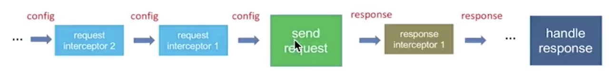

# Project setup and basic documentations

## Install Typescript
  * Make sure `node` is installed, install `typescript` and run `tsc -v` to make sure typescript is successfully installed.
    ```
    Yus-MacBook-Pro:TypescriptAxios yyu196$ npm -v
    6.1.0
    Yus-MacBook-Pro:TypescriptAxios yyu196$ npm install -g typescript
    // Successfully install `typescript`
    Yus-MacBook-Pro:~ yyu196$ tsc -v
    Version 3.7.2
    ```

## Basic Typescript Knowledge
  ### [Basic Types](./BasicTypescript/BasicTypes.md)
  ### [Variable Declarations](./BasicTypescript/VariableDeclarations.md)
  ### [Interfaces](./BasicTypescript/Interfaces.md)
  ### [Classes](./BasicTypescript/Classes.md)
  ### [Functions](./BasicTypescript/Functions.md)
  ### [Generics](./BasicTypescript/Generics.md)
  ### [Type Inference](./BasicTypescript/TypeInference.md)

## Features
  * Make `XMLHTTPRequests` from the browser
    * Transform URL (especially all parameters), Request Data (body), headers (normalize `Content-Type` field name and pass the correct field value) into correct form before `XMLHttpRequest` opens and sends data from browser.
    * Define `AxiosResponse` type and wrap it into `AxiosPromise` type. Handle `XMLHTTPRequestResponse` in a `AxiosPromise` for asynchronization purpose.
      * Convert `response.headers` from a string to a `json` object. 
      * Convert `response.data` from a string into a `json` object when possible.
  * Error Handling
    * Handle response with wrong Network Error, Timeout and Non-200 response status
    * Encapsulate error into an `AxiosError` class object.
  * Define an Axios interface with methods `request`, `get`, `delete`, `delete`, `head`, `options`, `post`, `put` and `patch`.
    * Encapsulate axios into an `Axios` class and an `AxiosInterface` that has one method. Mixin the class and the interface with request method in the `Axios` class binded to the interface's method.
    * Support `axios()` overloads as `axios(config)` and `axios(url, config)`.
    * Support generic types for response data.
  * Interceptor: Axios in typescript also support intercepting requests or responses before they are handled by `then` or `catch`.
    * Diagram demonstrating how this works.

      
    
    * Define an `InterceptorManager` interface, and expose `resolve` and `eject` methods. In the `InterceptorManager` class implementation, define an `Interceptor` interface and store all interceptors as an `Array<Interceptor>`.
    * Add member `interceptors` into `Axios` class as a `PromiseChain`, when `sendRequest`, going through all Promises in the chain before sending request to the backend.
  * Merge default and user-customized configurations
    * Define some default configurations and pass the default configuration into Axios object when the instance is created.
    * **Merge Configurations**: Implement three configuration merge strategies (`defaultStrat`, `fromUserValStrat` and `deepMergeStrat`) to combine default Axios configurations with user specified configurations. Call `mergeConfig` before adding `interceptors` into Axios request.
    * **TransformRequest/TransformResponse**: Implement transformer functions for requests and responses. Transform Request into correct form before send data to backend. And transform response into correct form before Promise resolves.
    * Support create a static Axios instance by adding a `AxiosStatic` interface that extends `AxiosInterface` and adding an `create()` function for `AxiosStatic` instance.
  * Cancel Request
    * Add a `CancelToken` object to `axios`, the `CancelToken` object will provide a `source` function that returns the `CancelToken` object itself and the `cancel` function.
    * For asynchroization purpose, `cancelToken` stores a pending `Promise` object. When the `cancel` function was executed, this will resolve the pending promise, cancel the request and call `reject()`.
  * `withCredentials`: If `http://domain-a.com` wants to send a request to `http://api.domain-b.com/get` with Cookies under `api.domain-b.com`. We need an additional boolean setup in `XMLHttpRequest` called `withCredentials`. So we also add this parameter in `AxiosRequestConfig` interface.
  * Cross-site Request Forgery (XSRF) Prevention (for knowledge see section below):
    * Definition of XSRF: 
      * CSRF (Cross-Site Request Forgery) is an attack that impersonates a trusted user and sends a website unwanted commands. This can be done, for example, by including malicious parameters in a URL behind a link that purports to go somewhere else
    * Implementation Detail:
      * Add `url` utility function to determine whether url in the request is the same origin as current window url.
      * Read XREF Token value from cookie based on `xsrfCookieName`
      * Add `xsrfHeaderName` as header and `xsrfCookieValue` as value to request
  * Upload Download monitoring
    * Add `onDownloadProgress` and `onUploadProgress` functions to `AxiosRequestConfig`
    * Bind both events to `XMLHttpRequest.onprogress` and `XMLHttpRequest.upload.onprogress`
  * HTTP Authorization
    * The HTTP Authorization request header contains the credentials to authenticate a user agent with a server, usually after the server has responded with a `401 Unauthorized` status and the `WWW-Authenticate` header.
    * Add `auth` representing credential to `AxiosRequestConfig`. Calling `btoa()` to `username:password` pair and pack it in the `XMLHTTPRequest`.
  * Customized status check
    * Add `validateStatus` in `AxiosRequestConfig` which defines whether to resolve or reject the promise for a given HTTP response status code.
    * If `validateStatus` returns `true` (or is set to `null` or `undefined`), the promise will be resolved; otherwise, the promise will be rejected.
  * `baseURL`
    * Add `baseURL` which defines a pre-defined base URL in request.
    * If input url is relative, combine basde and input url in the `XMLHTTPRequest`.
  * static methods
    * Support `Axios.all()` and `Axios.spread()` for processing requests and responses in batch.
    * `getUri()` to derive URL based on `AxiosRequestConfig` without calling service.

## Create Typescript project using `typescript-library-starter`
  ```
  git clone https://github.com/alexjoverm/typescript-library-starter.git src
  cd src

  # Run npm install and write your library name when asked. That's all!
  npm install
  ```

## Setup Demo for the project
  * Setup `SourceCodes/examples` directory and add `"dev": "node examples/server.js"` to `package.json` scripts section.
  * Setup routing to all directories in `SourceCodes/examples/index.html` and `SourceCodes/examples/server.js`.
  * Add demo examples to all directories under `SourceCodes/examples/app.ts` and `SourceCodes/examples/index.html` and let axios send Request via calling `axios` function or its exposed APIs defined in the interface.
  * Install npm packages `qs` and `@types/qa` for `config_merge` demo. This package can transform JSON into a proper text.
  * Install npm packages `cookie-parser` for `withCredential` demo. Follow the steps in `SourceCodes/withCredentials/app.ts` to test the feature.
  * Install npm packages `nprogress`, `css-loader`, `connect-multiparty` and `style-loader` for `upload_download` demo. Follow the steps in `SourceCodes/upload_download/app.ts` to test both features.
  * Install npm package `atob` for `authorization` demo.
  * Run `npm run dev`, go to `http://localhost:8080/` and check Network Response or other data in Chrome.

* Unit Test using `Jest`
  * Setup Jest with the following package versions, and `npm install` to update all releted packages to their latest version. 
    ```
    {
      "@types/jest": "^24.0.13",
      "jest": "^24.8.0",
      "jest-config": "^24.8.0",
      "ts-jest": "^24.0.2",
      "typescript": "^3.4.5"
    }
    ```
  * For request part test, install `jamine-ajax` related packages. Require all jasmine required packages in `/test/boot.ts` and install `Jasmine.AJAX` before requests test suite gets run.
    * In `test/helper.ts`, export a function `getAJAXRequest()` that resolves AJAX response promiese. 